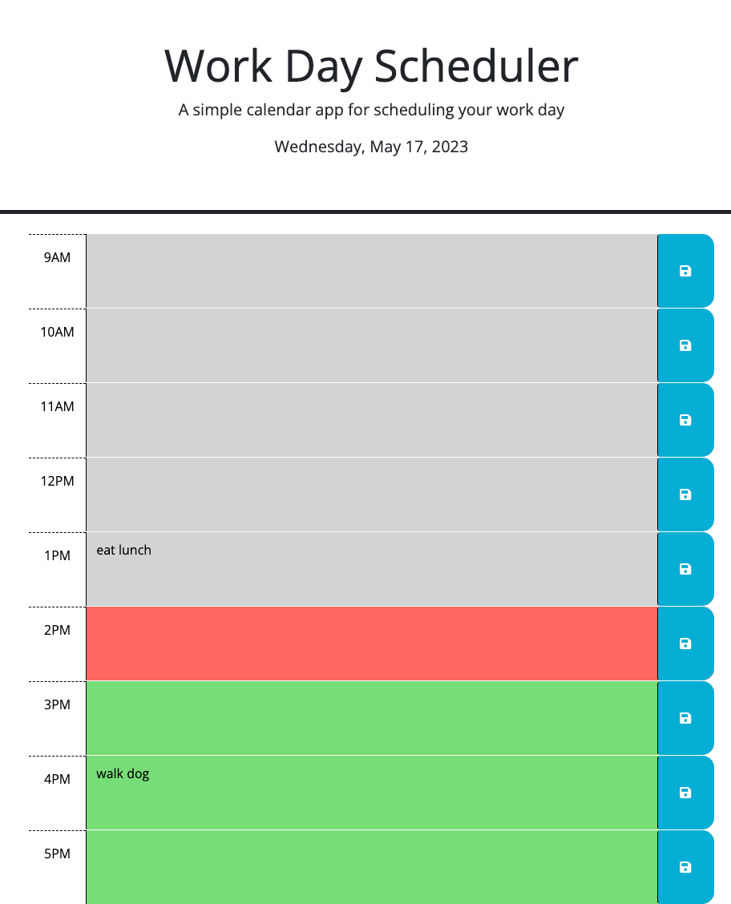

# work-day-scheduler

## Description
The goal of this project was to complete preexisting code to create a calendar application that allows a user to save and organize upcoming events to the calander using local storage. This project utilized HTML, jQuery, and Day.js to complete the following tasks: 

- upon opening calendar, the current day is displayed at the top of the screen
- depending on what the current hour is, each time block is color coded gray for past, red for present, or green for future
- upon clicking a time block, the user is able to enter text into the area
- upon clicking the save icon, the text from user input is saved to local storage with a key value identified by the corresponding time block id
- upon reloading the page, any events previously saved to local storage will appear within their corresponding time block

## Deployed Application

### URL
To launch the application, follow this link: 
[Work Day Scheduler](https://chesneyjulian.github.io/work-day-scheduler/)
### Screenshot

## Usage
- to enter in a new event, simply click on the correct time block, type information regarding event, and click the save button on the right of the time block
- to delete a preexisting event, click on the text, delete the desired text, and click the save button again

## Resources

This website was used to find proper jQuery documentation: [jQuery API](https://api.jquery.com/)

This website was used for proper Day.js formatting: [Day.js Format](https://day.js.org/docs/en/display/format)